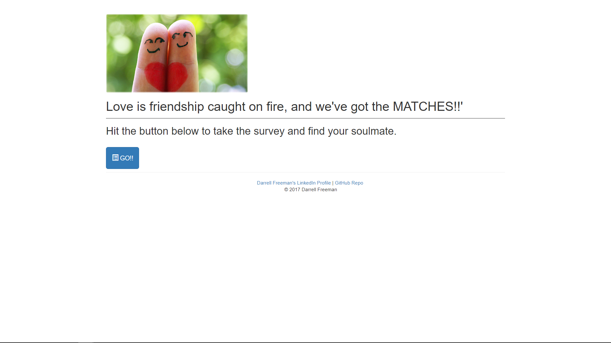
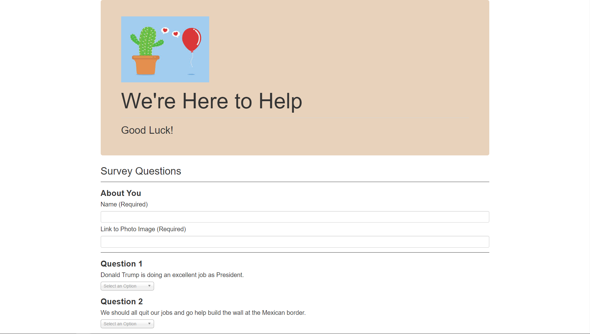

# FriendFinder

- Author:  Darrell Freeman
- Date: June 4, 2017
- Tools Used:  HTML, CSS, Javascript, JQuery, Node.js, NPM's (express, path, body-parser)

Friend Finder is an online dating app similar to E-Harmony, where the user answers a battery of questions and rates the intensity of their agreement or disagreement with a variety of statements.  The users responses are collected and compared against a database of potential suitors.  The logic built into the app then selects the most likely best match based on the similarity of the "friends" answers to those same questions.  

The app is initialized after the appropriate NPM packages are installed by running the command `node server.js` at the command terminal.

  <strong>Landing Page</strong>

  <kbd>
  
  </kbd>

 
 

Click the "Go" button to take the survey.
 
 

  <strong>Survey Page</strong>

  <kbd>
  
  </kbd>

